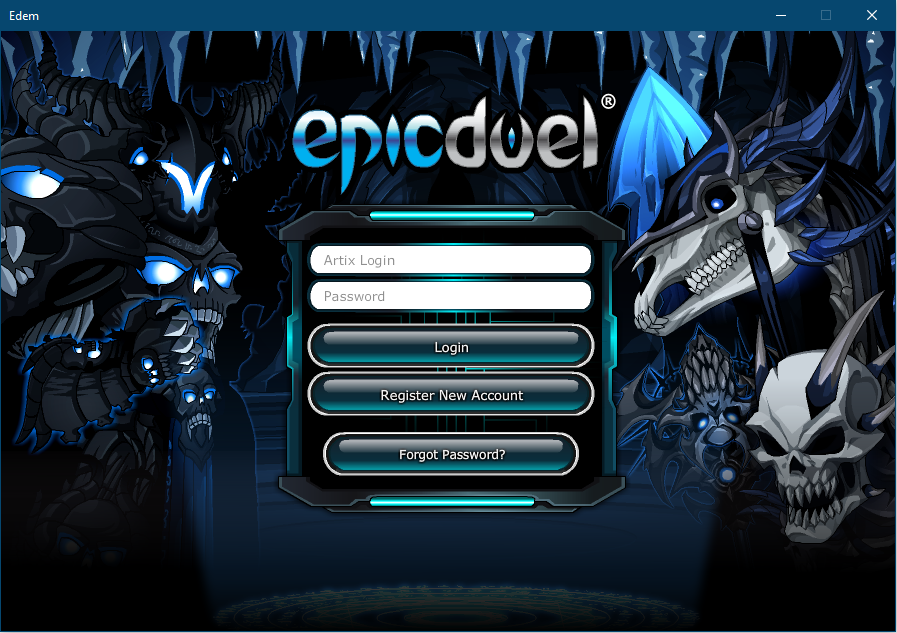

# Edem

This is an attempt to build a multiplayer modification framework referencing mainly Artix Entertainment free to play browser based video games. This was developed with a very limited knowledge of C# and currently serve as a demonstration of its feasibility. It is not intended to be by any mean stable.

## Screenshots
